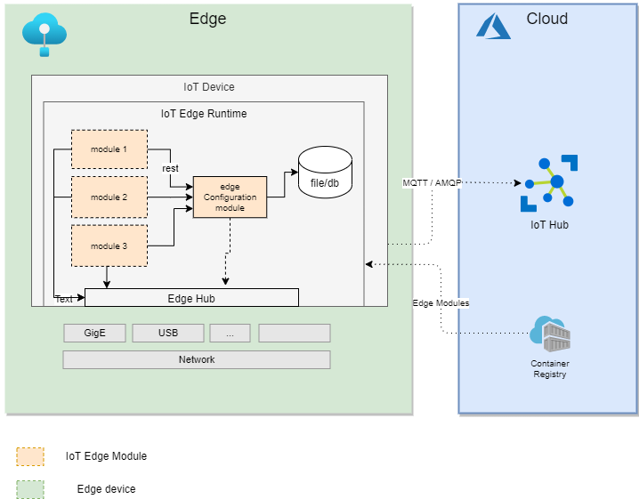

# Silo AI - Edge configuration server

This project consists of the code for running simplistic a Edge Configuration server. 

## Table of contents

1. [ About the project ](#About)
2. [ Getting started ](#Getting)
3. [ Run edge server locally ](#locally)
4. [ Run edge server inside docker](#runindocker)
5. [ Run docker in Azure IoT Edge ](#edge)
6. [ Silo AI ](#SILO)

<a a name=#About></a>
## About the project

Edge-server is server part of the project VQC Edge AI. other parts can be be found in a separate repos. For details about the Azure IoT Edge, see [EDGE](https://github.com/verifiablesoftware/vsw) which contains the info about. This repo is intended to to be used as edge server for handling edge module configurations. Internal structure of the Node.js based server can been seen in the image below.
currently server is not using Azure IoT Edge messaging.

## TODO
swagger if needed



<a a name=#Getting></a>
## Getting started

Clone this edge-server repo to youur local machine with 
```
git clone git@bitbucket.org:siloai/rd-vqc3d-edge-config-server.git
```

There are a set of shell scripts provided with the code repository. Some explanation of the scripts can be found below.

<a a name=#locally></a>
## Run edge server locally

```
npm install 
```

and start the server by using:
```
npm run start
```

or 
```
npm run start-dev
```

to run test cases (TODO relevant testing)
```
npm run test
```


or for Visual Studio Code debugging [VS Code](https://code.visualstudio.com/), there is ```Run locally start``` launch.json that launches local  debugging.


<a name=#runindocker></a>
## Run inside the docker

build docker image(s) 

```
docker build -f Dockerfile.local -t edge-config-server .
```

## run container with docker
and for example use the ports 3000
```
docker run -d --name edge-config-server -p 3000:3000 edge-config-server
```

<a name=#edge></a>
## Run edge-server in edge device

1. build container
2. push to ACR
3. deploy to edge device with relevant other modules


```
docker build -f Dockerfile.local -t edge-config-server .
docker tag edge-config-server:latest silovqc3d.azurecr.io/edge-config-server:0.0.1-amd64
az acr login --name silovqc3d
docker push silovqc3d.azurecr.io/edge-config-server:0.0.1-amd64
```

## client using server

### python

code example in python

post new configuration
```
import requests
url = "localhost:3000/config/pc"

payload={}
files=[
  ('file',('pc.yaml',open('<your path>/pc.yaml','rb'),'application/octet-stream'))
]
headers = {
  '': ''
}
response = requests.request("POST", url, headers=headers, data=payload, files=files)
print(response.text)
```

### C

c code example of the usage

```
CURL *curl;
CURLcode res;
curl = curl_easy_init();
if(curl) {
  curl_easy_setopt(curl, CURLOPT_CUSTOMREQUEST, "POST");
  curl_easy_setopt(curl, CURLOPT_URL, "localhost:3000/config/pc");
  curl_easy_setopt(curl, CURLOPT_FOLLOWLOCATION, 1L);
  curl_easy_setopt(curl, CURLOPT_DEFAULT_PROTOCOL, "https");
  struct curl_slist *headers = NULL;
  headers = curl_slist_append(headers, ": ");
  curl_easy_setopt(curl, CURLOPT_HTTPHEADER, headers);
  curl_mime *mime;
  curl_mimepart *part;
  mime = curl_mime_init(curl);
  part = curl_mime_addpart(mime);
  curl_mime_name(part, "file");
  curl_mime_filedata(part, "<your path>/pc.yaml");
  curl_easy_setopt(curl, CURLOPT_MIMEPOST, mime);
  res = curl_easy_perform(curl);
  curl_mime_free(mime);
}
curl_easy_cleanup(curl);
```


<a name=#SILOAI></a>
## Silo AI

